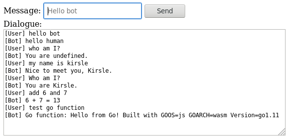

# WebAssembly from RiveScript-Go

This is an **experimental** binding of RiveScript-Go to WebAssembly and an
example front-end page that uses it.

It only supports these functions:

* `RiveScript.Stream(code, onDone())` to load code in and sortReplies.
* `RiveScript.Reply(username, message, onDone(reply))` to get a reply.

Online demo: <https://static.rivescript.com/demo/wasm/>

## Screenshot



## Building

* `make` or `make build` will produce the rivescript.wasm binary.
* `make run` will build it and then also run a simple Go HTTP server so you
  can test it at <http://localhost:8000>

## How It Works

I learned from [this guide][1] how to get two-way function calling between
the Go code in WASM and JavaScript functions.

It requires a bit of boilerplate on either side to connect them all together.
I implemented this for the Stream() and Reply() functions, which is just
enough to get a demo running. I haven't tested whether LoadFile() or other
methods would work, but I imagine they probably would not.

Here is example code for exposing the Reply() function.

In `main.go`:

```go
// Reply function callback that the JS user will be calling.
fnReply := js.NewCallback(func(args []js.Value) {
    // Convert the JavaScript arguments into Go types we want.
    var (
        username = args[0].String()
        message  = args[1].String()
        thenFn   = args[2] // a JS-side callback we invoke when we're done
    )

    // Do your Go stuff.
    reply, err := bot.Reply(username, message)
    if err != nil {
        reply = "Error: " + err.Error()
    }

    // Invoke the JS-side callback with the answer.
    thenFn.Invoke(js.ValueOf(reply))
})
defer fnReply.Release()

// Look up the global variable __replyRegistered (a function type)
// and then execute it giving it our function above.
setReply := js.Global().Get("__replyRegistered")
setReply.Invoke(fnReply)
```

The front-end boilerplate then:

```javascript
// XXX: I made a global RiveScript object to give this a nice-ish API,
// so the RiveScript.Reply name will be the Go function from the wasm.
const RiveScript = {
    Reply: null,
};

// Global variables.
let __replyReceived;
let __replyResolve; // this is a Promise we create

// Go invokes this function to give us the Reply callback function.
function __replyRegistered(callback) {
  RiveScript.Reply = callback;
  __replyResolve();
}

// When we are ready to launch the WASM binary.
async function start() {
  const go = new Go();
  let result = await WebAssembly.instantiateStreaming(
    fetch("rivescript.wasm"),
    go.importObject
  );

  // Create the promise initialized in the global scope.
  __replyReceived = new Promise(resolve => {
    __replyResolve = resolve;
  })

  // Start the WASM binary.
  const run = go.run(result.instance);

  // Await on the promises to verify we have everything ready.
  await __replyReceived;

  // Down here we are safe to call these functions now.
  RiveScript.Reply("user", "hello bot", function(reply) {
    window.alert(reply);
  });
}
```

It's a bit confusing and I'll iron out what exactly it's doing later and
find a way to simplify it. For now there are two examples in the source
for the Stream and Reply functions.

## License

MIT.

[1]: https://medium.zenika.com/go-1-11-webassembly-for-the-gophers-ae4bb8b1ee03
